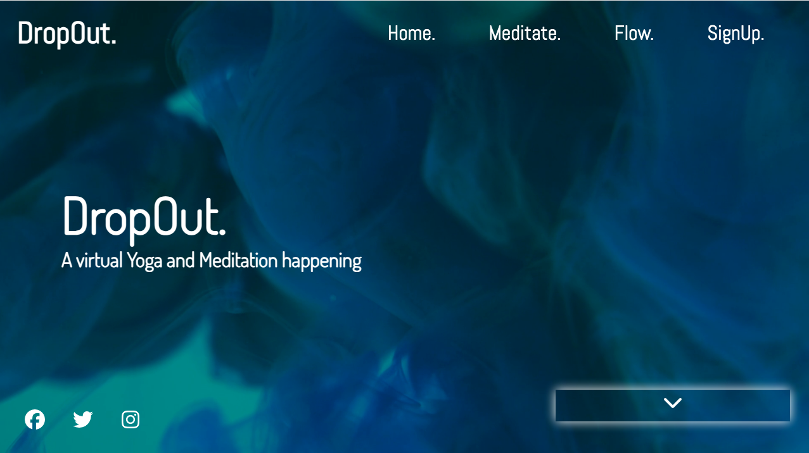
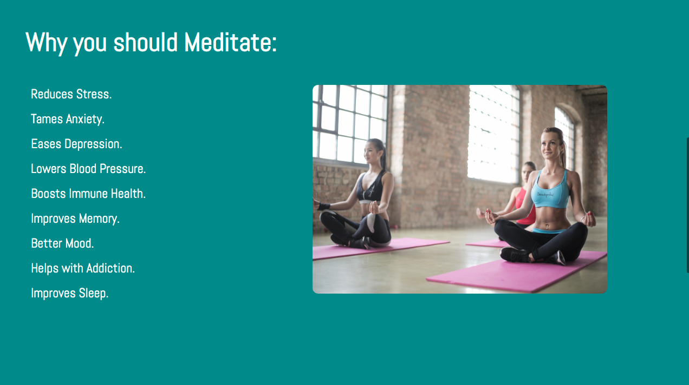
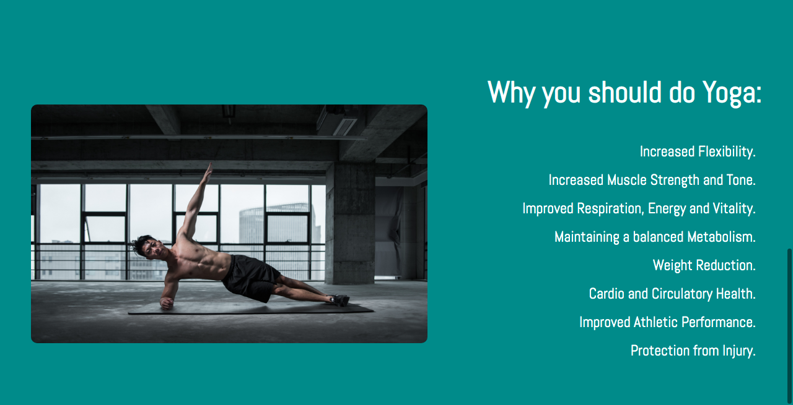
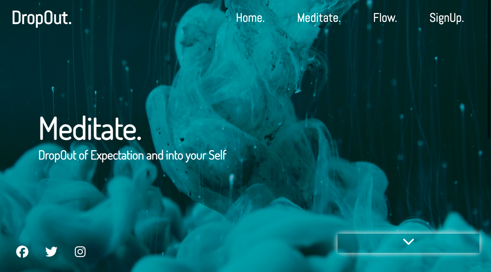
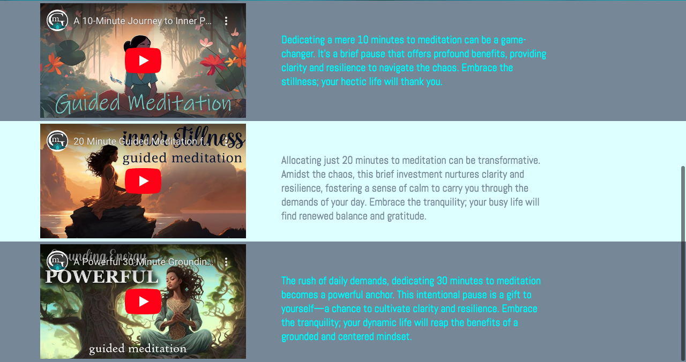
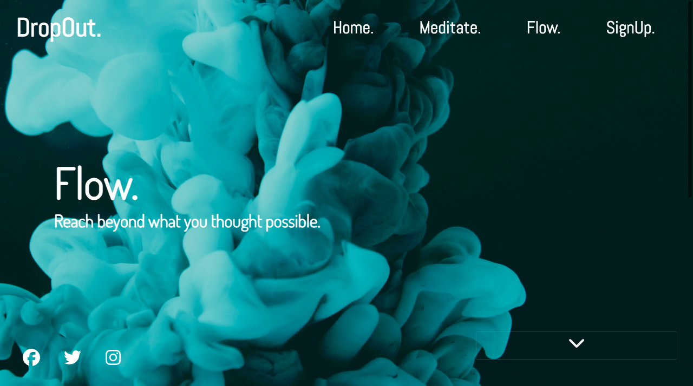
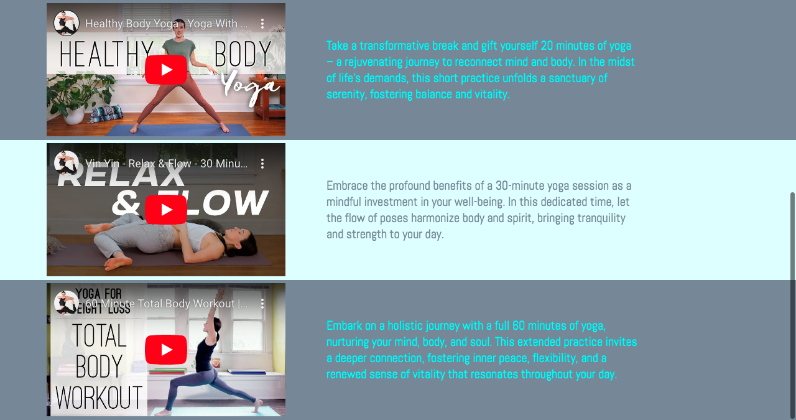
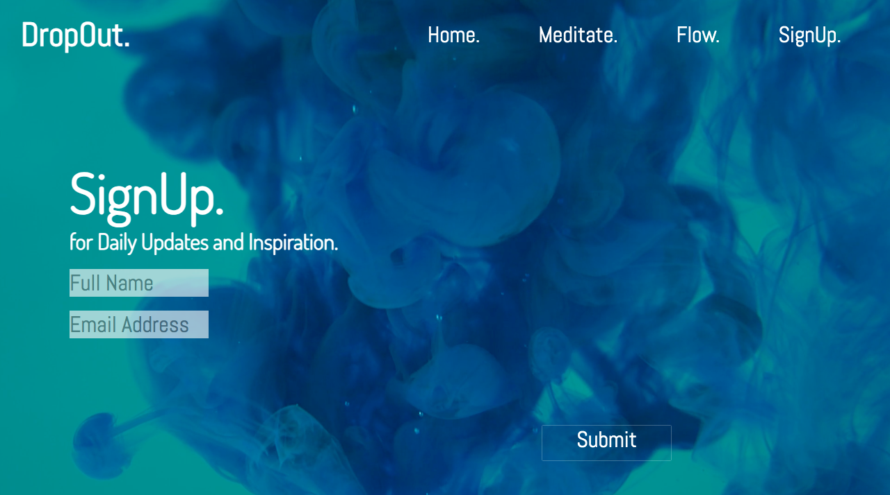
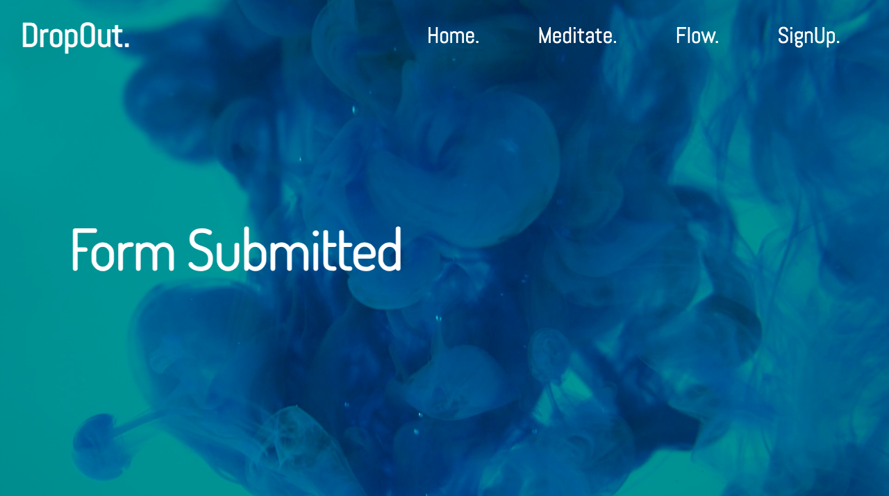

# DropOut. 
A Virtual Yoga and Meditation Happening

## Overview

The **DropOut** webpage is a virtual platform designed to promote yoga and meditation practices. It serves as an engaging and informative space for users interested in exploring the benefits of meditation and yoga. The site features a visually appealing showcase section on each page with a video background, providing a calming ambiance and video options for meditation or yoga practices of varying lengths of time. 

## Landing Page 

## Contents

1. **Header Section**
   - The header includes the DropOut logo and a navigation menu.
   - Navigation links include "Home," "Meditate," "Flow," and "SignUp."

2. **Showcase Section**
   - A captivating video background with an overlay.
   - Descriptive text introducing DropOut as a virtual Yoga and Meditation happening.
   - A button to trigger the display of additional content.

3. **Content Section**
   - **Benefits of Meditation**
     - A list of reasons why one should meditate.
     - An accompanying image of a person meditating.

   - **Benefits of Yoga**
     - A list of reasons to practice yoga.
     - An image illustrating a yoga pose.

4. **Footer Section**
   - Social media links (Facebook, Twitter, Instagram) for community engagement.

## Functionality

The webpage includes a JavaScript function that toggles the display of additional content when the user clicks the "trigger-switch" button. This feature enhances user interaction, allowing them to explore information at their pace.

## Meditate. Page 

The **DropOut Meditate** webpage is a platform focused on promoting meditation practices. It offers a serene and immersive experience to encourage users to incorporate meditation into their daily lives. The site features engaging video content, informative blurbs, and a user-friendly design.

## Contents

1. **Header Section**
   - The header includes the DropOut logo, navigation menu, and a toggle button for mobile responsiveness.
   - Navigation links include "Home," "Meditate," "Flow," and "SignUp."

2. **Showcase Section**
   - A captivating video background with an overlay.
   - Descriptive text emphasizing the theme: "DropOut of Expectation and into your Self."

3. **Content Section**
   - **Meditation Videos**
     - Three embedded YouTube videos with accompanying blurbs.
     - Each video emphasizes the transformative impact of dedicating time to meditation.

4. **Footer Section**
   - Social media links (Facebook, Twitter, Instagram) for community engagement.
  
## Flow. Page

The **DropOut Flow** webpage is dedicated to promoting the practice of yoga and encouraging users to embrace the flow of movement and mindfulness. With a visually appealing design and embedded yoga videos, the page provides a serene space for users to explore and engage in yoga practices.

## Contents

1. **Header Section**
   - The header includes the DropOut logo, navigation menu, and a toggle button for mobile responsiveness.
   - Navigation links include "Home," "Meditate," "Flow," and "SignUp."

2. **Showcase Section**
   - A captivating video background with an overlay.
   - Descriptive text emphasizing the theme: "Reach beyond what you thought possible."
  

3. **Content Section**
   - **Yoga Videos**
     - Three embedded YouTube videos with accompanying blurbs.
     - Each video encourages users to take a transformative break, embracing the benefits of 20, 30, and 60-minute yoga sessions.
    

## SignUp. Page

The **DropOut SignUp** webpage provides a platform for users to sign up for daily updates and inspiration. With an engaging design, the page encourages users to register by filling out a simple form. The page is part of the DropOut website, offering a seamless experience for those interested in staying connected.

## Contents

1. **Header Section**
   - The header includes the DropOut logo, navigation menu, and a toggle button for mobile responsiveness.
   - Navigation links include "Home," "Meditate," "Flow," and "SignUp."

2. **Showcase Section**
   - A visually appealing video background with an overlay.
   - Descriptive text inviting users to sign up for daily updates and inspiration.
  

3. **Sign-Up Form**
   - A form with fields for the user's full name and email address.
   - A submit button for users to complete the sign-up process.

## Form-Submitted Page

The **DropOut Form Submitted** webpage serves as a confirmation page, indicating successful form submission for users who have signed up. This page provides a simple and clear message to inform users that their registration has been received.

## Contents

1. **Header Section**
   - The header includes the DropOut logo, navigation menu, and a toggle button for mobile responsiveness.
   - Navigation links include "Home," "Meditate," "Flow," and "SignUp."

2. **Showcase Section**
   - A visually appealing still image background with an overlay.
   - A brief text message indicating that the form has been successfully submitted.
  

3. **Footer Section**
   - Social media links (Facebook, Twitter, Instagram) for community engagement.

## Functionality

The page serves as a confirmation message for users who have successfully submitted the sign-up form. It provides a visual indication that their registration has been received.

## External Resources

- **FontAwesome Kit:**
  - Utilizes FontAwesome icons for social media links.
  - Kit loaded from [https://kit.fontawesome.com/5125eaa352.js](https://kit.fontawesome.com/5125eaa352.js).
 
## Testing

**Nav Menu Links**

All nav menu links on each page were tested for functionality and to ensure consistant response and design accross each page of the website. 
All tests were successfull

**Footer Social Media Links**

All footer social media links were tested for functionality and to ensure consistant response and design accross each page of the website. 
All tests were successfull.

**Trigger-Switch**

All trigger switch a tags on all pages were tested to make sure that they brought the user to the correct part of the website when clicked. 
All tests were successfull. 

**Embedded Videos**

All embedded videos were tested for funcionality and all videos are working correctly as of the time of submission. 

**Media Queries**

Dropout. was tested using multiple mobile devices using the inspect functionality on google chrome. All elements responded as expected on smaller devices. 

## Known issues 

While all efforts were taken to ensure responsive design when viewing the website on mobiie device screens. Some elements could display on top of eachother unexpectedly depending on the dimensions of the screen. 

The form submit button is not currently a working submit button. An a tag was used to link to another page to indicate to user that form has submitted. 
It also does not work on the smallest of media screens. This will need to be fixed in an update. 

## Credits

- The JavaScript toggle function was adapted from the "How to toggle Hide and Show" article on [w3schools.com](https://www.w3schools.com/howto/howto_js_toggle_hide_show.asp).
- Some code is taken and influenced by a project by traversy media on youtube and that video
  can be found at (https://youtu.be/8MgpE2DTTKA)

